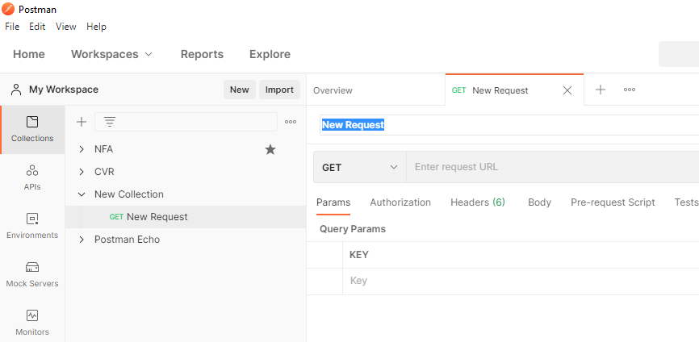
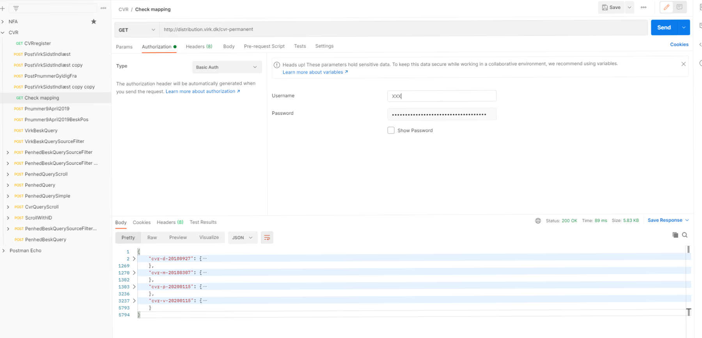

<style type="text/css">

section {
	clear: both;
	padding: 12px;
	margin: 0px;
}

img {
      padding: 12px;
      margin: 0px;
}
picture {
      padding: 12px;
      margin: 0px;
}

figure {
      padding: 12px;
}
body{ /* Normal  */
      font-size: 14px;
      padding: 20px;
  }
td {  /* Table  */
  font-size: 12px;
  padding: 12px;
}
h1.title {
  font-size: 38px;
  color: Black;
}
h1 { /* Header 1 */
  font-size: 18px;
  color: Black;
}
h2 { /* Header 2 */
    font-size: 22px;
  color: DarkBlue;
}
h3 { /* Header 3 */
  font-size: 18px;
  font-family: "Times New Roman", Times, serif;
  color: DarkBlue;
}
code.r{ /* Code block */
    font-size: 12px;
}
pre { /* Code block - determines code spacing between lines */
    font-size: 14px;
}
</style>

```{r setup, include=FALSE}
knitr::opts_chunk$set(echo = TRUE)
```

Denne artikel introducerer, hvordan man kan komme i gang med at lave udtræk med CVR-data, som opbevares i en ElasticSearch-database. Udtrækkene laves med Postman, som også introduceres. Det er sværere at automatisere udtrækkene i Postman fremfor eksempelvis at bruge R eller Python, men hvis ikke man har prøve at lave en URL-request, hvor man skriver en "Body", så er Postman et godt sted at starte, fordi programmet hjælper en med at opstille en request.

Det fleste kender til data opstillet i tabulær form (rækker og kolonner). Udtræk fra ElasticSearch kommer dog i .json. Hvis man eksempelvis arbejder i R kan man omforme data med `jsonlite`-pakken. Det beskrives dog ikke nærmere i denne artikel.

Artikel har følgende opbygning: Først introduceres download af Postman, herefter beskrives, hvordan man kommer i gang med Postman. Så vises det, hvordan man får en oversigt over databasen med CVR-data. Det vises herefter, hvordan man laver en Query / Forespørgsel til databasen og endelig illustreres det, hvordan man kan udtrække mange data fra databasen med scroll (dog kræver det en del manuelt arbejde i Postman).

For at kunne hente data skal man først have en bruger hos Erhvervsstyrelsen. Det får man ved at skrive til cvrselvbetjening@erst.dk. Se i øvrigt https://data.virk.dk/datakatalog/erhvervsstyrelsen/system-til-system-adgang-til-cvr-data.

# Download Postman

Download Postman-appen fra https://www.postman.com/downloads/.

# Kom i gang med Postman

Åben Postman og lav først en ny "Collection", som vist nedenfor.


Herefter tilføjer du en ny "Request" ved at højreklikke på din nye folder "New Collection".


Du kan nu trykke på den nytilføjede request: 



# Databaseoversigt (Get mapping)

Næste trin er at få en oversigt over indholdet i databasen. Det gør man ved at anmode om at se databasens "mapping". Hvis man er vandt til data opdelt i rækker og kolonner, så kan en database organiseret i JSON godt virker lidt overvældende. Løst kan JSON-formatet oversættes til følgende:

 - index repræsenterer en database
 - type repræsenterer et datasæt
 - fields repræsenterer en kolonne
 - document repræsenterer en række
 
En udemærket introduktion til forskellige koncepter i ElasticSearch og sammenhængen til en relationel databaser kan ses her: https://www.youtube.com/watch?v=ksTTlXNLick 

For at du kan tilgå databasen skal du først indsætte brugernavn og password, som du har fået udleveret af Erhvervsstyrelsen.

## Tilføj credentials

Tryk på "Authorization"-fanen. Ud fra Type vælg "Basic Auth" og indsæt relevante oplysninger.



Skriv http://distribution.virk.dk/cvr-permanent til højre for "Get" og tryk "Send". Vær opmærksom på der ikke er tomme felter/mellemrum indsat til sidst. Det vil give en fejlmeddelelse.

Svaret fra dit kald til databasen vil se ud som vist nedenfor, hvis du trykker på de små pile, så koden folder sig op.


 
Her kan du se, at der er fire databaser: 

 - cvr-d-20180927
 - cvr-m-20180307
 - cvr-p-20200115
 - cvr-v-20200115
 
Ved at trykke på pilene igen kan du se indholdet i de enkelte databaser. Det er lidt uoverskueligt i starten, men en god reference når man skal søge i databasen, fordi oversigten angiver, hvilken type variabel der bruges. Ligesom i andre programmeringssprog er det ikke uvæsentligt om en variabel er en karakter, data eller numerisk variabel.

# Query / Forespørgsel

Næste trin er at lave en forespørgsel, hvor vi sætter et filter på, hvad data vi skal hente hjem fra databasen.

 - Tryk på den lille pil ved feltet "Get" og vælg "Post"
 - Tryk på Body. I linjen men "none", "form-data"... Vælg da "raw" og JSON. Ellers få du fejl. 
 - Skriv http://distribution.virk.dk/cvr-permanent/_search i feltet ved siden af "Post".
 - Skriv koden som vist i billedet nedenfor i kodefeltet (eller copy-paste kodestykket under screen-shottet.)
 - Tryk "Send"
 - Under kodestykket du selv har indsæt kommer noget nyt kode. 
 - Sørg for at vælge "Pretty" og "JSON"


Nedenstående kode er nemmere at kopiere:

```{r, eval=FALSE}
{
	"size" : 10,
    "query": {
        "bool": {
            "must": [
            	{
                "range": {
                    "Vrvirksomhed.aarsbeskaeftigelse.aar": {
                        "lt": "2019",
                          "gt": "2017"
                              }
                          }
                 }
                     ]
            
                 }
    }
}
```

Overstående forespørgsel giver et væld af informationer. Ved at tilføje "_source" kan vi vælge, at det kun er nogle specifikke fields (kolonner om man vil), der udskrives. Nedenfor er det kun informationer i indlejret i `Vrvirksomhed.aarsbeskaeftigelse` og `Vrvirksomhed.penheder`, der udskrives.


Koden kan også ses her:

```{r, eval=FALSE}
{
	"_source": ["Vrvirksomhed.aarsbeskaeftigelse", "Vrvirksomhed.penheder"],
	"size" : 10,
    "query": {
        "bool": {
            "must": [
            	{
                "range": {
                    "Vrvirksomhed.aarsbeskaeftigelse.aar": {
                        "lt": "2019",
                          "gt": "2017"
                              }
                          }
                 }
                     ]
            
                 }
    }
}
```

# Udskriv mange informationer (scroll)

En udfordring ved ElasticSearch er, at der kun udskrives et begrænset antal observationer. Default er 10 observationer. Dette kan hæves til 3.000 observationer, når man trækker data fra Erhvervsstyrelsens CVR-database. Hvis man skal hive flere observationer ud kan man bruge scroll-funktionen i ElasticSearch. Det giver mulighed for at hive 3.000 observationer ud efterfulgt af de næste 3.000 observationer osv. 

Her illustreres eksemplet ved at copy-paste output over i en noteblok, som herefter omdøbes til at have en .json ekstension. Det er selvsagt ikke en særligt skalerbar metode. For at automatisere denne proces skal man bruge et program som eksempelvis R, Python, C# mv. Dette afdækkes imidlertig ikke i denne artikel.

Første skridt er at ændre sin "Post" / URL-request til:

```{r, eval=FALSE}
http://distribution.virk.dk/cvr-permanent/_search?scroll=1m
```

Samtidig kan size-parameteren i ens body opjusteres til 3000 observationer. Send herefter din request (tryk Send) og i dit svar kommer nu et scroll-id (se figur nedenfor). 


Lav en ny Post-request med følgendew URL-request: 

```{r, eval=FALSE}
http://distribution.virk.dk/_search/scroll
```

Og skriv følgende i din "Body", hvor du indsætter det scroll-id, som du fik i forrige scroll.

```{r,eval=FALSE}
{
    "scroll": "1m",
    "scroll_id": "DnF1ZXJ5VGhlbkZldGNoDQAAAAAmwwdGFjZEQUcyd1JzUVF1RzhBWWNjTER1WUEAAAAAJsMHRxY2REFHMndSc1FRdUc4QVljY0xEdVlBAAAAACbDB0gWNkRBRzJ3UnNRUXVHOEFZY2NMRHVZQQAAAAAmycAzFnJJU1NwRnh2VGkyWTBtQVJPckZlZ0EAAAAAJsTH9hZsOVJReVVYVVR0cVFuTWJyN2JMSzZRAAAAACbDB0kWNkRBRzJ3UnNRUXVHOEFZY2NMRHVZQQAAAAAmwwdKFjZEQUcyd1JzUVF1RzhBWWNjTER1WUEAAAAAJsTH9xZsOVJReVVYVVR0cVFuTWJyN2JMSzZRAAAAACbJwDQWcklTU3BGeHZUaTJZMG1BUk9yRmVnQQAAAAAmxMf4Fmw5UlF5VVhVVHRxUW5NYnI3YkxLNlEAAAAAJsTH-RZsOVJReVVYVVR0cVFuTWJyN2JMSzZRAAAAACbJwDUWcklTU3BGeHZUaTJZMG1BUk9yRmVnQQAAAAAmycA2FnJJU1NwRnh2VGkyWTBtQVJPckZlZ0E="
}
```

Figuren nedenfor illustrerer også eksemplet:


Tryk "Send" og de næste 3.000 observationer dukker op. Gem data i et notesblok, hvor du omdøber din extension til .json (fx 01data.json, ..., 12data.json) indtil du har "scrollet" igennem alle observationer.

Se eventuelt denne video for en bedre forståelse af scroll-API'en: https://www.youtube.com/watch?v=8noSYHuTeSM

*Note: Jeg har prøvet at bruge scroll i R med pakkerne `httr`, `elastic` og `elasticsearchr`, men kan ikke få adgang til at bruge scroll-API'en fra R, selvom det virker fra Postman. Hvis man har en liste med CVR-numre, hvor man vil knytte en særlig information i et datasæt kan man eventuelt lave en for-loop, som finder og gemmer alle relevante informationer.*

Hvis du har forslag til forbedringer/korrektur er du velkommen til at skrive en mail til mig. Mine oplysninger er her: https://nfa.dk/da/Forskning/Person?employeeId=c94aeb87-1861-49a7-b46c-fe82e52f59a5


